# Module der Oberfläche — Bausteinkatalog

> **Stand:** 30. September 2026 · Rocket 26.9.7
> **Für wen:** alle, die an Rocket, Relay, Insilo oder einer weiteren
> AImighty-App bauen. Rocket ist nur die erste App, in der die Bausteine
> beschrieben sind.

## Worum es geht

Die Apps der Schmiede sollen nicht gleich aussehen, aber man soll Dinge
wiederfinden: Ein Dialog öffnet sich überall gleich, die Suche sitzt
überall oben, ein Fehler hat überall ein Zeichen und einen Satz. Dieses
Dokument gibt jedem Baustein der Rocket-Oberfläche einen festen Namen,
zeigt ihn, sagt, wo er steht, und bewertet, ob eine andere App ihn
übernehmen kann.

Es ändert nichts an den Apps. Es ist die Karte, nach der man übernimmt.

## Die Kennung

Jeder Baustein hat eine **Kennung**, die an drei Stellen gleich steht:
hier, im Kopfkommentar seiner Datei (`Modul HB-DIALOG`) und in der
Überschrift seines Abschnitts in `frontend/app/globals.css`
(`[HB-DIALOG]`). Wer im Code auf eine Kennung stößt, findet sie hier; wer
hier liest, findet den Code mit einer Suche nach der Kennung.

| Vorsilbe | Bedeutung | Gilt für |
|---|---|---|
| **AM-** | aus dem **AImighty-Designpaket**, unverändert | alle Apps gleich — Änderungen nur im Paket, nie in einer App |
| **HB-** | **Hausbaustein** — in Rocket gebaut, aber nicht rocketspezifisch | gedacht für alle Apps; wer ihn übernimmt, behält die Kennung |
| **RK-** | **Rocket-Fachmodul** — CRM-Fachlichkeit | nur Rocket; das *Muster* kann Vorbild sein |

**Übertragbar** heißt in den Tabellen:

- ● **1:1** — Datei und CSS-Abschnitt kopieren, fertig.
- ◐ **mit Anpassung** — was zu tauschen ist, steht dabei (meist ein
  Cookie-Name, ein Endpunkt, ein Produktwort).
- ○ **Rocket-eigen** — hängt an Rockets API und Typen; übernehmbar ist
  das Muster, nicht der Code.

## Übersicht

| Kennung | Baustein | Datei(en) | Übertragbar |
|---|---|---|---|
| AM-TOKEN | Token: Farbe, Raum, Zielgrößen, Dunkelmodus | `globals.css` Kopf | ● |
| AM-KNOPF | Knöpfe | `globals.css` | ● |
| AM-FELD | Formularfelder | `globals.css` | ● |
| AM-HAKEN | Häkchen und Schalter (CSS) | `globals.css` | ● |
| AM-KARTE | Karte | `globals.css` | ● |
| AM-HUELLE | Hülle: Raster aus Kopfleiste, Spalte, Inhalt | `globals.css` | ● |
| AM-LEER | Leerzustand | `globals.css` | ● |
| HB-MARKE | AImighty-Wortmarke | `marke.tsx` | ● |
| HB-DARSTELLUNG | Hell / Dunkel / System | `darstellung.tsx` | ◐ Cookie-Name |
| HB-NAVIGATION | Seitenspalte, „Mehr", Favoriten, Einklappen | `huelle.tsx`, `navigation.tsx` | ◐ Ziele, Favoritenquelle |
| HB-KOPFLEISTE | Leiste oben: Marke, Suche, Erstellen | `kopfleiste.tsx` | ◐ Produktwort, Ziele |
| HB-SUCHE | Suchen oder fragen (⌘K) | `suche.tsx` | ○ Muster |
| HB-KONTO | Kontozeile und Nachweis unten links | `konto.tsx` | ○ Muster |
| HB-SEITENKOPF | Titel, Anzahl, Rückweg, Knöpfe | `seitenkopf.tsx` | ● |
| HB-ZUSTAND | Lädt, Fehler, Leer, Hinweiszeile | `zustaende.tsx` | ● |
| HB-SCHALTER | Ein/Aus-Schalter | `schalter.tsx` | ● |
| HB-KNOPFMENUE | Knopf mit zweitem Weg | `knopfmenue.tsx` | ● |
| HB-MEHRFACH | Mehrfachauswahl | `mehrfachauswahl.tsx` | ● |
| HB-ERKLAERUNG | Ein Satz, der Rest hinter ⓘ | `erklaerung.tsx` | ● |
| HB-DIALOG | Dialog und Rückfrage: Schicht, Karte, Kopf/Mitte/Fuß, Tastatur | `dialog.tsx`, `dialogfalle.ts` | ● |
| HB-FELDREIHE | Felder nebeneinander, auf dem Handy untereinander | CSS | ● |
| HB-TEXT | Textrollen: leise, Randnotiz, gelungen, rechtsbündig, Seitenrand | CSS | ● |
| HB-TASTATUR | Tastaturwege: Reiter, Menüs, Brett | `lib/tasten.ts` | ● |
| HB-TOR | Anmeldeseiten | `tor.tsx` | ◐ Produktwort |
| HB-FAKTOR | Zweiter Faktor: Codefeld, Codeliste | `zweiter-faktor.tsx` | ● / ○ |
| HB-FEHLERMELDER | Oberflächenfehler ins Pod-Log | `fehlermelder.tsx` | ◐ Endpunkt |
| HB-ASSISTENT | Schild, Panel, Karte zum Bestätigen | `assistent.tsx`, `schild.tsx` | ◐ Endpunkt, Beispiele |
| HB-KI | KI-Kennzeichnung: Block, Knopf, goldener Punkt | CSS, `ki-knopf.tsx` | ● / ◐ |
| HB-PILLE | Stufen- und Dringlichkeitspille | `stufe.tsx`, `prioritaet.tsx` | ● CSS / ◐ Werte |
| HB-KENNZAHL | Kennzahlen und Balken | CSS | ● |
| HB-BLOCK | Datensatzseite und Block | CSS | ● |
| HB-TABELLE | Werkzeugleiste, Datentabelle, Rollfläche | CSS | ● |
| HB-ZEITLEISTE | Verlauf mit KI-Punkt | `zeitleiste.tsx` | ◐ Darstellung / ○ Daten |
| HB-BOARD | Brett mit Spalten und Karten, auch per Tastatur | CSS, `brett.tsx` | ● CSS / ○ Seite |
| HB-EINSTELLUNGEN | Unterpunkte und Block-Muster der Einstellungen | CSS, `einstellungen/page.tsx` | ● Muster |
| HB-DRUCK | A4-Dokument und Druck | CSS | ● CSS / ○ Seite |
| RK-SEGMENTLISTE | Listen mit Ansichten, Filter, Spalten, Stapel | `segmentliste.tsx`, `filterbau.tsx` | ○ (◐ Filterbau) |
| RK-FELDGRUPPEN | Eigenschaften in Gruppen am Datensatz | `feldgruppen.tsx`, `lib/feldwerte.ts`, `lib/anordnung.ts` | ○ (◐ lib) |
| RK-EIGENSCHAFTEN | Eigenschaften verwalten | `eigenschaften-verwalten.tsx` | ○ |
| RK-STAMMDATEN | Stammdaten ohne Gruppen | `stammdaten.tsx` | ◐ |
| RK-NOTIZ | Notiz → Struktur | `notizkasten.tsx` | ○ |
| RK-ANLEGEN | Anlegen-Dialoge, Beschreiben, Hineinwerfen | `*-anlegen.tsx`, `finden.tsx`, `erfassung.tsx` | ○ |
| RK-AUFGABEN | Aufgabenliste | `app/aufgaben` | ○ (● CSS) |
| RK-TICKET | Tickets, Antwort per Mail | `app/tickets`, `ticket-antwort.tsx` | ○ |
| RK-BRIEFING | Tagesbriefing | `briefing.tsx` | ○ |
| RK-PROGNOSE | Prognose | `app/prognose` | ○ |
| RK-DOKUMENTE | Dateien am Datensatz | `dokumente.tsx` | ◐ |
| RK-EINFUHR | CSV-Einfuhr | `einfuhr.tsx` | ○ (● CSS) |
| RK-DATENBANK | Datenbank-Blick | `app/datenbank` | ○ |
| RK-PODCAST | Gespräch vorbereiten | `podcast.tsx` | ○ |
| RK-ANGEBOT | Angebot und Druckfassung | `app/angebote` | ○ |
| RK-LEAD | Beteiligte, Qualifizierung, Firmen am Kontakt | `beteiligte.tsx`, `qualifizierung.tsx`, `kontakt-firmen.tsx` | ○ |
| RK-ANREICHERUNG | Anreichern aus Website und Suche | `anreicherung.tsx`, `personen-finden.tsx` | ○ |
| RK-VERSAND | Listen, Kampagnen, Einwilligung | `app/listen`, `app/kampagnen`, `einwilligung.tsx` | ○ |
| RK-WISSEN | Fragen, Erkenntnisse, Eingang, Besprechungen | `app/fragen` u. a. | ○ |
| RK-EINSTELLUNGEN | Die Blöcke der Einstellungen | `mitglieder.tsx`, `versand.tsx` u. a. | ○ |

---

## Fundament — AM

Diese Teile kommen aus dem AImighty-Paket (über Insilo) und stehen in
jeder App gleich. **Wer hier etwas ändern will, ändert das Paket**, nicht
die App — sonst laufen die Apps auseinander.

### AM-TOKEN — Token

`globals.css`, Kopf bis „Bauteile". Alles andere liest nur `var(--am-*)`.

- **Farbe:** Hanseatenblau `--am-blau-25…950` (900 Grundfläche, 500
  Wendepunkt), Gold `--am-gold-200…900` (500 das eine Markengold, 800 Gold
  als Text), Zustände `--am-erfolg|hinweis|achtung|fehler` je mit
  `-flaeche` und `-rand`.
- **Rollen statt Farben:** `--am-seite`, `--am-flaeche-1/2/3`,
  `--am-text-primaer/-sekundaer/-gedaempft/-deaktiviert`,
  `--am-handlung-*`, `--am-rand`, `--am-fokus-ring`,
  `--am-gold-beschriftung`, `--am-schatten-1`. Bauteile nehmen die Rolle,
  nie die Palette.
- **Raum:** `--am-raum-1/2/3/4/6/8/12/16` (4 bis 64 px), gebunden an
  `--am-skalierung`. **Es gibt kein `--am-raum-5`** — eine unbekannte
  Variable lässt die ganze Angabe fallen.
- **Zielgrößen:** `--am-ziel-zeiger` 40 px, `--am-ziel-beruehrung` 44 px
  „ohne Ausnahme".
- **Dunkelmodus:** Klasse `dunkel` an `<html>`, gesetzt von
  HB-DARSTELLUNG. Eine eigene Rollenverteilung, kein Filter: Flächen
  werden Blau 900/800/700, **Handlung wird Gold** (Blau auf Blau trägt
  nicht).
- **Schrift:** Geist, lokal über `next/font/local`, nie vom CDN.

### AM-KNOPF — Knöpfe

`.btn` mit `.btn-primaer`, `.btn-sekundaer`, `.btn-still`; Größen
`.btn-klein` (gleiche Höhe, weniger Polster) und `.btn-symbol`
(quadratisch). Reihe: `.btn-reihe`. Auf Berührungsgeräten 44 px.

- **Eine** primäre Handlung je Ansicht.
- `.btn-gefahr` (rot) ist eine Rocket-Ergänzung für endgültige Schritte.

### AM-FELD — Formularfelder

`.feld` mit `label`, optional `label .optional`, Eingabe, `.feld-hinweis`,
`.feld-fehlertext`; Fehlerzustand `.feld.fehler`. Auswahlfelder haben
einen eigenen Pfeil. Auf Berührungsgeräten 44 px hoch.

- Formulare mit `noValidate`: Der Browser lehnte `gruppe.de` in einem
  URL-Feld stumm ab. Geprüft wird im Code, mit einem Satz.

### AM-HAKEN — Häkchen und Schalter

Häkchen neu gezeichnet (im Dunkeln Gold). Schalter: `.schalter-zeile`,
`.schalter(.an)`, `.schalter-knauf`, `.schalter-text`,
`.schalter-hinweis` — das Bauteil dazu ist HB-SCHALTER.

> „Ein Häkchen fragt ‚trifft zu?', ein Schalter sagt ‚läuft'."

### AM-KARTE — Karte

`.karte`: Fläche 1, Rand, Radius mittel. Grundlage von Dialog und
Einstellungskarten.

### AM-HUELLE — Hülle

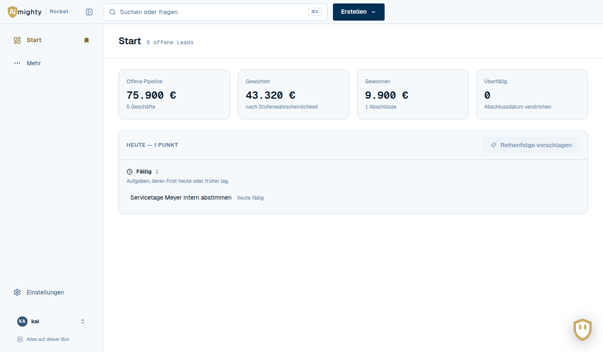

Raster aus Kopfleiste (oben, ganze Breite), Navigation (links ab 1024 px,
darunter als Leiste unten) und Inhalt. Klassen `.huelle`, `.huelle-nav`,
`.huelle-inhalt`, `.huelle-fuss`, `.kopfleiste`. Spaltenbreite 240 px,
eingeklappt 64 px.

<details><summary>Dunkel</summary>

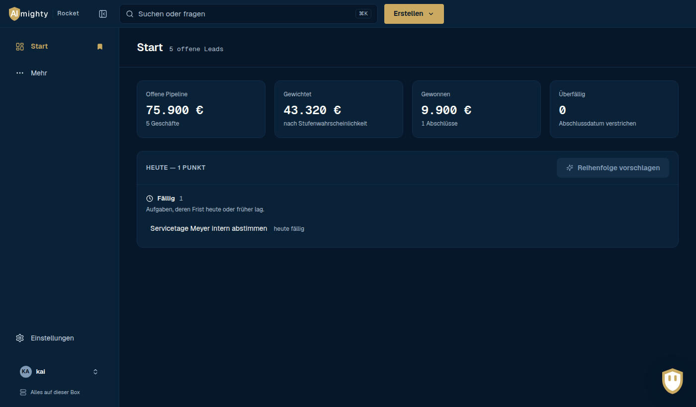

</details>

### AM-LEER — Leerzustand


`.leerzustand` mit Zeichen, Titel und Satz. Das Bauteil dazu ist
`Leer` in HB-ZUSTAND. Der Titel ist `p.leerzustand-titel`, **keine
Überschrift** — als `h4` übersprang er zwei Ebenen.

---

## Hausbausteine — HB

In Rocket gebaut, aber ohne CRM-Fachlichkeit. Diese Teile sind der
Kandidat für „überall gleich": Wer sie in Relay braucht, nimmt sie von
hier und behält die Kennung.

### HB-MARKE — Wortmarke ●

`components/marke.tsx` → `Marke()`. Zwei Bilder (hell/dunkel) aus
`public/marke/`, umgeschaltet nur per CSS. Das Produktwort („Rocket")
setzt der Aufrufer daneben (`.marke-produkt`).

- Dateien unverändert aus `aimighty/marke/logo/` — nie nachzeichnen.
- Entschieden 30.9.2026: Die Marke bleibt, auch wenn der Markt „kein Logo"
  vorgibt.

### HB-DARSTELLUNG — Hell / Dunkel / System ◐

`components/darstellung.tsx` → `Darstellungsschalter()`,
`DARSTELLUNG_SCRIPT`. Drei Knöpfe in einer Gruppe, Wahl im Cookie
(gerätebezogen, nicht im Konto). Das Skript läuft in `<head>` vor dem
ersten Anstrich, sonst blitzt Hell auf.

**Übernahme:** Cookie-Name `rocket-darstellung` tauschen.

### HB-NAVIGATION — Seitenspalte ◐

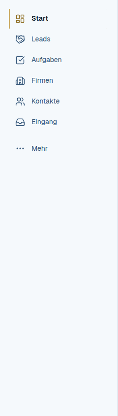

`components/huelle.tsx` → `Huelle({ children })`; `components/navigation.tsx`
→ `useNavigationKlapp()`, `Klappschalter`, `NAVIGATION_SCRIPT`.

- **Kurze Leiste nach HubSpot:** Sie zeigt nur, was man mit dem
  Lesezeichen markiert hat. „Mehr" öffnet ein Feld mit allen Bereichen in
  Gruppen, dort hat jeder Eintrag sein Lesezeichen.
- **Einklappen** mit ⌘B / Strg+B, gemerkt im Cookie (die Breite hängt am
  Bildschirm, nicht an der Person).
- **Unten:** HB-KONTO.
- **Handy:** Leiste unten, „Mehr" als Feld darüber.
- **Tastatur:** `aria-current="page"`, Mehr-Feld als Dialog mit Fokus
  hinein und Escape zurück.

**Übernahme:** `lib/navigation.ts` (Ziele und Gruppen) und die
Favoritenquelle (`useFavoriten` gegen `/api/mitglieder/wer`) tauschen,
Cookie-Name tauschen. Das Gerüst bleibt.

### HB-KOPFLEISTE — Suchen und Anlegen von überall ◐

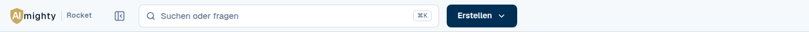

`components/kopfleiste.tsx` → `Kopfleiste({ eingeklappt, klappen })`.
Links Marke, Produktwort und Klappschalter, in der Mitte HB-SUCHE, rechts
„Erstellen ▾" (HB-KNOPFMENUE-Klassen).

- **Bewusst nur zwei Dinge:** suchen und anlegen. Konto und Nachweis
  bleiben unten.
- „Erstellen" öffnet ein Menü. Jeder Eintrag führt auf die Zielseite mit
  `?neu=1`; dort öffnet sich der Dialog. Die Dialoge sitzen nicht in der
  Hülle, sonst stellte jede Seite ihre Abfragen.
- **Handy:** Das Wort weicht dem Plus; der Knopf behält `aria-label`.

**Übernahme:** Produktwort und `NEU_ZIELE` (`lib/neu.ts`) tauschen.

### HB-SUCHE — Suchen oder fragen ○

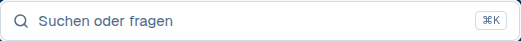

`components/suche.tsx` → `Suchfeld()`. Das Feld in der Leiste ist das
echte Feld; die Treffer klappen darunter auf.

- **Treffer** ab zwei Zeichen, jeder mit Art, Titel und Unterzeile.
- **Frage:** Endet der Text auf „?" oder hat er vier Wörter, bietet die
  Suche „Frage stellen" an. Das Modell läuft erst auf Knopfdruck.
- **Tastatur:** ⌘K fokussiert, ↑/↓ wählt, Enter öffnet, Escape schließt.

**Übernahme:** Das Muster (Combobox mit Palette, Klassen `.kopfsuche*`,
`.suchpalette-*`) ist allgemein. Die Datenquelle `/api/suche` und die
Routen sind Rocket.

### HB-KONTO — Kontozeile und Nachweis ○

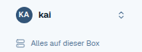

`components/konto.tsx` → `Kontozeile()`, `Nachweiszeile()`.

- **Kontozeile:** Initialen und Name. Das Menü klappt nach oben und
  enthält Darstellung, Konto und Abmelden. „Abmelden" erscheint nur, wenn
  die App selbst anmeldet — sonst wäre es eine Attrappe.
- **Nachweiszeile:** gemessen, nicht behauptet — „Alles auf dieser Box"
  oder „2 Ziele außerhalb" mit den Hosts im `title`. Das Zeichen wechselt
  mit der Aussage.

**Übernahme:** Das Muster passt für jede App, die Datenquelle
(`/api/anmeldung/lage`, `/api/settings`) muss neu.

### HB-SEITENKOPF — Seitenkopf ●

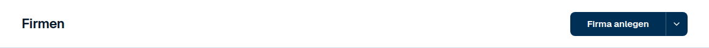

`components/seitenkopf.tsx` → `Seitenkopf({ titel, zahl?, pfad?, children? })`.
`h1` und Anzahl in einer Zeile, darüber der Rückweg (`← Firmen`), rechts
die Knöpfe. Er bleibt beim Rollen stehen. Seine Höhe `--am-kopfhoehe`
ist dieselbe wie die der Marke links — die Linie reißt nicht.

### HB-ZUSTAND — Lädt, Fehler, Leer, Hinweis ●

`components/zustaende.tsx` → `Laedt({ text? })`, `Fehler({ text })`,
`Leer({ titel, text })`. Dazu die Hinweiszeile `.hinweis` mit
`data-art="achtung"|"fehler"`.

- **Fehler** hat immer Zeichen und Satz und `role="alert"`. Farbe trägt
  die Aussage nie allein.
- Die Hinweiszeile ersetzt den ungenutzten Paket-Streifen `.streifen`.

### HB-SCHALTER — Ein/Aus ●

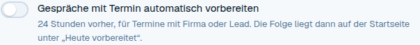

`components/schalter.tsx` →
`Schalter({ an, umschalten, text, hinweis?, id? })`.
`button[role=switch][aria-checked]` plus `label`. Die ganze Zeile ist
klickbar.

### HB-KNOPFMENUE — Knopf mit zweitem Weg ●

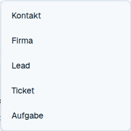

`components/knopfmenue.tsx` → `Knopfmenue({ text, eintraege })`.
Hauptteil führt den ersten Weg aus, der Pfeil öffnet die übrigen
(„Kontakt anlegen" / „Aus CSV einfügen"). Die Klassen nutzt auch
„Erstellen" in der Kopfleiste.

### HB-MEHRFACH — Mehrfachauswahl ●

`components/mehrfachauswahl.tsx` →
`Mehrfachauswahl({ optionen, gewaehlt, beiAendern, … })`,
`Mehrfachplaettchen({ werte, grenze? })`.

- Plättchen im Feld, getippt wird gesucht, die Liste bleibt offen.
- Die Tafel hängt am `body` (sonst schneidet eine Karte sie ab) und klappt
  nach oben, wenn dort mehr Platz ist.
- **Tastatur:** voll bedienbar (Combobox, ↑/↓, Enter, Rücktaste). Escape
  schließt nur die Liste, nicht den Dialog drumherum.
- Ab etwa sieben Werten statt Häkchen.

### HB-ERKLAERUNG — Ein Satz, der Rest hinter ⓘ ●

`components/erklaerung.tsx` → `Erklaerung({ kurz, lang? })`. Für
Einstellungen: Ein Satz steht für alle da, die Einzelheiten hinter dem
Info-Knopf.

### HB-DIALOG — Dialog ●

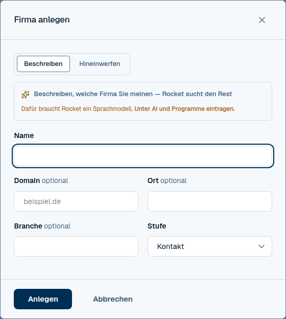

`components/dialog.tsx` → `Dialog({ titel, label?, breite?, beiSchliessen, beiSenden, children })`
und `Rueckfrage({ titel, label, text?, beiSchliessen, knopf, vorsicht?, children? })`.
Beide bringen den Tastatur-Hook `useDialogfalle` (`dialogfalle.ts`) mit.

```tsx
<Dialog titel="Firma anlegen" beiSchliessen={zu} beiSenden={() => anlegen.mutate()}>
  <div className="dialog-koerper">…Felder…</div>
  <div className="dialog-fuss">…Knöpfe…</div>
</Dialog>

<Rueckfrage titel="Wirklich löschen?" label="Löschen bestätigen" text={folgen}
  beiSchliessen={zu} knopf={<button className="btn btn-primaer" …>Löschen</button>} />
```

- **Breiten** als Variante, nie inline: `breite="normal"` (35rem),
  `"schmal"` (30rem), `"breit"` (39rem). Die Rückfrage ist 27,5rem.
- Bis 26.9.5 stand das Markup in jeder Datei einzeln — mit vier
  verschiedenen Breiten, und drei Dialoge (Liste, Kampagne, Eingang) hatten
  die Tastaturführung vergessen.
- **Kopf und Fuß stehen fest, nur die Mitte rollt.** Vorher wanderte
  „Anlegen" aus dem Bild. Höhe höchstens 46rem.
- **Tastatur (`useDialogfalle`):**
  - Fokus ins erste Feld;
  - Tab bleibt im Dialog;
  - Escape schließt;
  - danach geht der Fokus dorthin zurück, wo er vorher war;
  - verschwindet das fokussierte Feld (etwa beim Nachladen), holt der
    Hook den Fokus zurück.
- **Rückfragen vor dem Löschen:** Der Fokus steht auf „Abbrechen", damit
  ein Enter nichts löscht (`vorsicht`, Vorgabe). Beim Verlustgrund steht er
  im ersten Feld (`vorsicht={false}`).
- **Regel:** Jeder neue Dialog ist ein `Dialog` oder eine `Rueckfrage`.

<details><summary>Dunkel</summary>

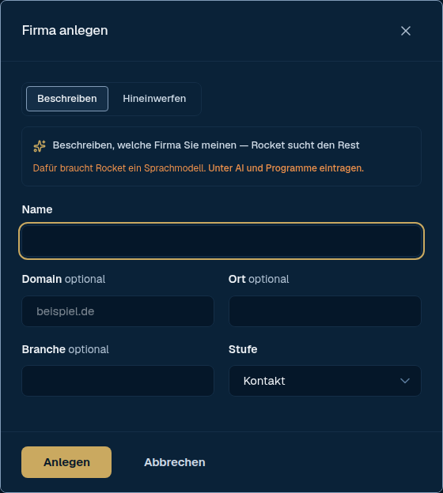

</details>

### HB-FELDREIHE — Felder nebeneinander ●

`.feldreihe` mit den Spalten in `--spalten` (Vorgabe zwei gleiche),
unter 40rem untereinander; `.feld-paar` für das feste Paar im Dialog.

```tsx
<div className="feldreihe" style={{ "--spalten": "minmax(0, 2fr) minmax(0, 1fr)" } as React.CSSProperties}>
```

**Regel:** Spalten nie inline mit `gridTemplateColumns` — das galt auch
auf dem Handy und schnitt Server, Port und Verschlüsselung ab.

### HB-TEXT — Textrollen ●

Was vorher an über sechzig Stellen als Inline-Stil stand, hat einen Namen:

| Klasse | Wofür |
|---|---|
| `.text-leise` | der leise Satz unter einem Block oder Feld |
| `.text-leise-klein` | Randnotiz, Meta-Angabe |
| `.text-zweit` | Nebentext in Sekundärfarbe |
| `.text-gelungen` | „Gespeichert." und andere Bestätigungen |
| `.rechts` | rechtsbündige Spalte in `.tabelle` |
| `.seitenrand` | Meldung unter dem Seitenkopf, auf die Breite des Inhalts eingerückt |
| `.zeile-unter` | zweite, leisere Zeile in einer Tabellenzelle |

**Regel:** Ein neuer Text mit Rolle nimmt die Klasse, nicht `style`.

### HB-TASTATUR — Tastaturwege ●

`lib/tasten.ts` — reine Funktionen, getestet:

- `reiterTaste(e)`: an jede `role="tablist"`; ←/→/Pos1/Ende wechseln und
  wählen den Reiter.
- `menueTaste(key, feld)`: im offenen Menü ↑/↓/Pos1/Ende. Den Rest (Fokus
  hinein, Escape mit Fokus zurück, Tab schließt) macht
  `useMenue()` in `knopfmenue.tsx` — auch für „Erstellen".
- `nachbarspalte(taste, spalte, anzahl)`: Alt+←/→ im Brett (HB-BOARD).

### HB-TOR — Anmeldeseiten ◐

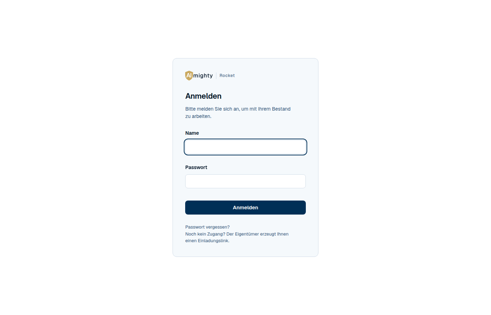

`components/tor.tsx` →
`Tor({ titel, unter?, fehler?, laeuft?, knopf, onSenden, children, fuss? })`.
Eine Karte in der Mitte, Marke oben, ein Knopf. Benutzt für Anmelden,
Code, Einladung und Passwort vergessen.

- Die Seite sagt so wenig wie möglich: keine Kontenliste, kein „Name
  unbekannt".
- Nach dem Anmelden folgt ein harter Seitenwechsel — der alte
  Zwischenspeicher gehört einer anderen Person.

**Übernahme:** Das Produktwort „Rocket" steht fest im Bauteil; als Prop
herausziehen.

### HB-FAKTOR — Zweiter Faktor ● / ○

`components/zweiter-faktor.tsx`:

- **`Codefeld`** und **`Codeliste`** ●: Eingabe für den Code aus der App
  (`one-time-code`, Mono) und die einmalige Liste der
  Wiederherstellungscodes mit „notiert"-Häkchen.
- **`FaktorEinrichtung`** und **`Faktorblock`** ○: Einrichten mit QR und
  Ein-/Abschalten, an Rockets Anmelde-API.
- Der QR kommt als SVG vom Server und wird als `data:`-Bild eingebunden,
  nie als Markup.

### HB-FEHLERMELDER — Fehler ins Pod-Log ◐

`components/fehlermelder.tsx` → `Fehlermelder()`, `fehlerMelden(fehler)`.
Hört auf Fehler und unbehandelte Promises und schickt höchstens fünf je
Seite an `/api/fehler`. Wirft selbst nie; schickt keine Formulardaten.

**Übernahme:** braucht den Endpunkt `/api/fehler` auf der anderen Seite.

### HB-ASSISTENT — Assistent ◐

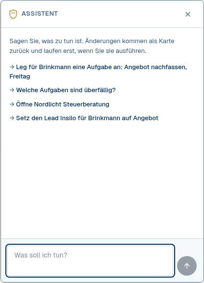

`components/assistent.tsx` → `Assistent()`; `components/schild.tsx` →
`Schild({ size?, zwinkert? })`.

- Das goldene Schild unten rechts öffnet ein Panel: Verlauf, Eingabe
  (Enter sendet), Beispiele.
- **Lesen sofort, Schreiben mit Karte:** Was die App ändern würde,
  erscheint als Karte mit „Ausführen" / „Verwerfen". Nichts wird
  geschrieben, bevor ein Mensch drückt.
- Das Schild blinzelt ab und zu, nicht bei `prefers-reduced-motion`.
- **Der Assistent ist Relay nachgebaut** (Kommentar im Code). Hier
  treffen sich die Apps schon; bei einer Überarbeitung beide gemeinsam
  ansehen.

**Übernahme:** Endpunkt `/api/assistent` und die Beispiele tauschen.

### HB-KI — KI-Kennzeichnung ● / ◐

Was ein Modell geschrieben hat, ist als solches erkennbar — in einem Jahr
muss man unterscheiden können, was ein Mensch notiert hat.

- **KI-Block** `.ki-block`, `.ki-block-kopf`, `.ki-block-text` ●:
  Goldrand auf Goldfläche, Kopf versal („Vorschlag der KI"). Kein
  Bauteil, das Markup steht an den Stellen.
- **Zeitleiste:** goldener Punkt `li[data-art="ai"]`, Zeichen ✦ und
  „Modell: …" darunter — nie nur Farbe.
- **`KiKnopf({ pfad, text, invalidiert })`** ◐: Ist kein Sprachmodell
  eingerichtet, ist der Knopf gesperrt und sagt warum, statt in einen
  Verbindungsfehler zu laufen. Braucht `/api/ki/status`.

### HB-PILLE — Stufe und Dringlichkeit ● CSS / ◐ Werte


`.stufe` mit Punkt und Wort (`data-stufe` oder `data-art="won|lost|open"`);
`.prio` mit `data-prio`. Bauteile `Stufenpille`, `Dealstufe`,
`Prioritaetspille`.

- Punkt **und** Wort. Rot nur für den Ernstfall.
- Kontrast geprüft: Gold 900 auf Goldfläche (5,1:1), im Dunkeln ohne
  Fläche.
- `.stufe` taugt auch als Abzeichen („eingerichtet", Anzahl).

### HB-KENNZAHL — Kennzahlen und Balken ●

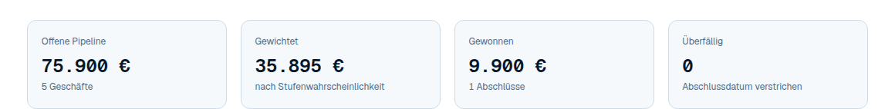

`dl.kennzahlen > .kennzahl > dt, dd, dd.kennzahl-fuss`. Zahl in Geist Mono,
tabellarisch. Balken `.balken > .balken-fuell[data-betont]` für einfache
Anteile — keine Diagrammbibliothek für sechs Balken.

### HB-BLOCK — Datensatzseite und Block ●

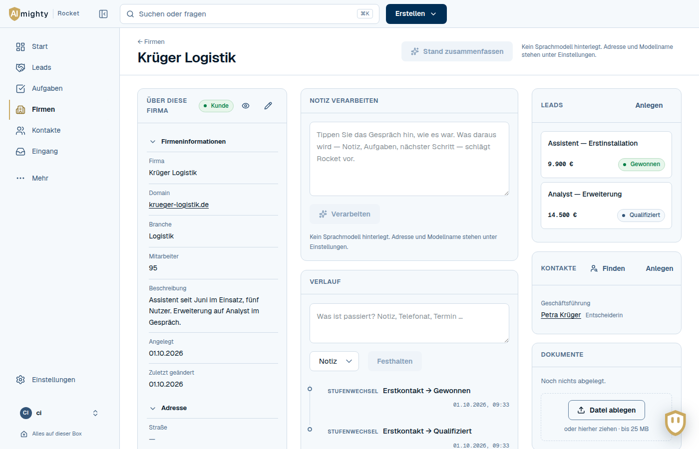

`.datensatz` mit drei Bereichen ab 1100 px (links Eigenschaften, Mitte
Verlauf, rechts was daranhängt); darunter eine Spalte, Verlauf zuerst.
Varianten `.datensatz-zwei` (zweispaltig) und `.datensatz-seitenleiste`
(Hauptteil und 260 px).

Jeder Kasten ist ein `.block`: `.block-kopf` mit kleinem, versalem `h2`
und Aktionen rechts, darunter `.block-inhalt`. Breite Tabellen rollen im
Block.

<details><summary>Dunkel</summary>

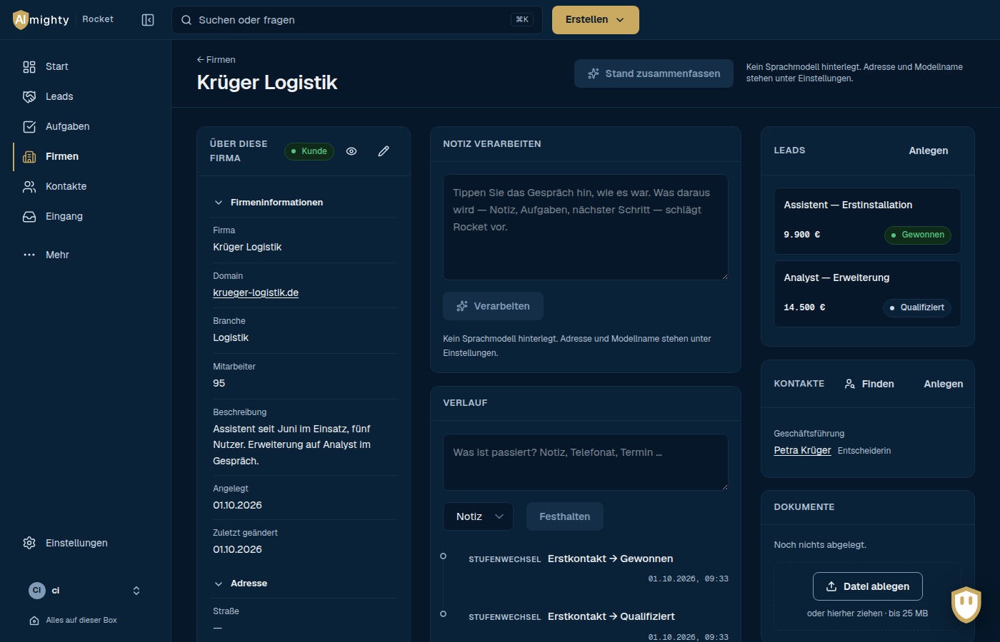

</details>

### HB-TABELLE — Werkzeugleiste und Datentabelle ●

`.werkzeugleiste` (Suche, Knöpfe, Zähler) über `.tabelle` (Zahlen
rechtsbündig in Mono, `td.haupt` für die Namensspalte). Breite Tabellen
stehen in `.rollbar` mit `tabIndex={0}`, damit man auch mit der Tastatur
seitlich rollt. Leere Kopfzellen tragen
`<span className="nur-vorleser">Aktionen</span>`.

**Zeilen, die irgendwohin führen,** tragen `data-ziel` (erst dann zeigt
sich die Hand), und der Haupttext der ersten Spalte ist ein Link
`.zeilen-ziel` — so erreicht man jede Zeile mit Tab und öffnet sie mit
Enter. Eine Liste ohne eigene Seite je Zeile (Aufgaben) hat beides nicht.

### HB-ZEITLEISTE — Verlauf ◐ / ○

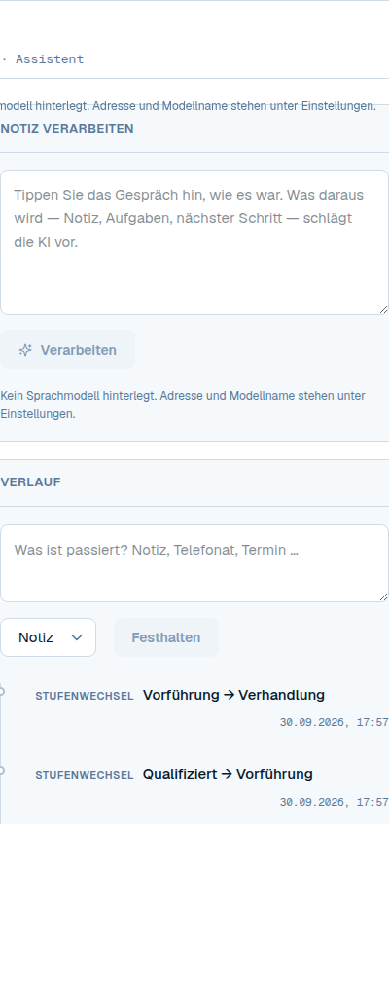

`components/zeitleiste.tsx` → `Zeitleiste({ bezug })`. Oben das Feld
zum Festhalten, darunter `ul.zeitleiste` mit Punkt, Art, Betreff, Zeit und
Text. Menschliche Einträge lassen sich ändern und zurücknehmen, KI-Einträge
tragen die Kennzeichnung aus HB-KI.

**Übernahme:** Die Darstellung (Klassen `.zeitleiste*`) passt für jeden
Verlauf, auch einen Nachrichtenfaden. Die Datenquelle `/api/activities`
und die Arten sind Rocket. Sinnvoll wäre ein reines Anzeige-Bauteil
`Zeitleiste(eintraege)`.

### HB-BOARD — Brett ● CSS / ○ Seite

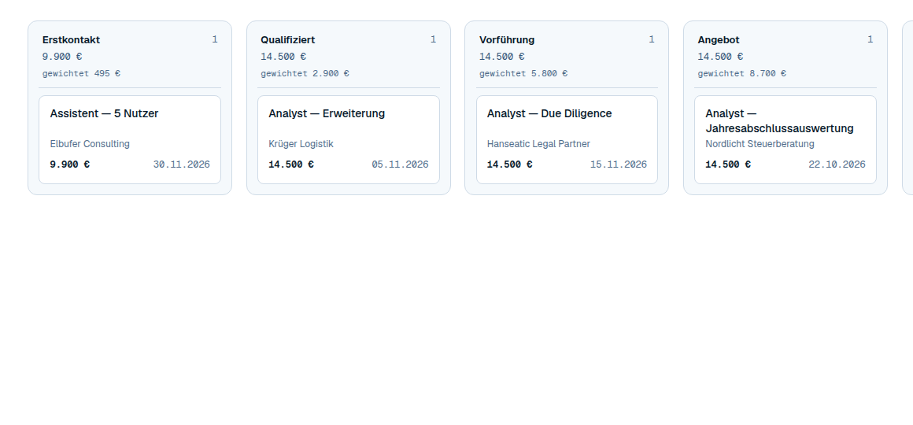

`.board`, `.board-spalte` (feste Breite, waagerecht rollbar),
`.deal-karte` (alle gleich hoch — sonst liest man eine Rangfolge heraus).

**Tastatur** (`components/brett.tsx`, `useBrettTastatur`, `BrettHinweis`):
Alt+← / Alt+→ auf einer Karte schiebt sie in die Nachbarspalte, wie das
Ziehen. Der Fokus folgt der Karte, ein Vorleser hört „Nach ‚Angebot'
verschoben". Jede Karte trägt `data-karte` und verweist auf den Hinweis.
Rocket nutzt es für Leads und Tickets; für Relay taugt es etwa für
Postzustände.

### HB-EINSTELLUNGEN — Unterpunkte und Block-Muster ● Muster

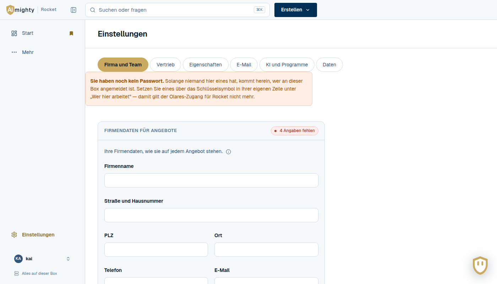

- **Unterpunkte** `nav.unterpunkte > a.unterpunkt(.aktiv)` mit
  `?bereich=`.
- **Jeder Bereich ist eine Folge von Blöcken:**
  - `.block-kopf` mit Titel und Stand („eingerichtet" als HB-PILLE);
  - darunter HB-ERKLAERUNG, dann Felder;
  - dann „Speichern" und, wo es etwas zu verbinden gibt, **„Testen" als
    Pflicht**. Zugangsdaten, die erst später scheitern, sind keine
    Einrichtung.
- **Geheimnisse:** Ein leeres Feld heißt „nicht angefasst", der Platzhalter
  zeigt Anfang und Ende des gespeicherten Schlüssels.

### HB-DRUCK — A4-Dokument ● CSS / ○ Seite

`.druck-seite`, `.dokument`, `.dokument-*` (210 mm, feste Ränder) und
`@media print`: Beim Drucken bleibt nur das Dokument. Eigene Seite statt
Dialog. Rocket druckt damit Angebote; Relay könnte Briefe drucken.

---

## Rocket-Fachmodule — RK

Diese Module tragen CRM-Fachlichkeit. Für andere Apps sind sie Vorbild,
nicht Kopiervorlage.

### RK-SEGMENTLISTE — Listen ○ (◐ Filterbau)

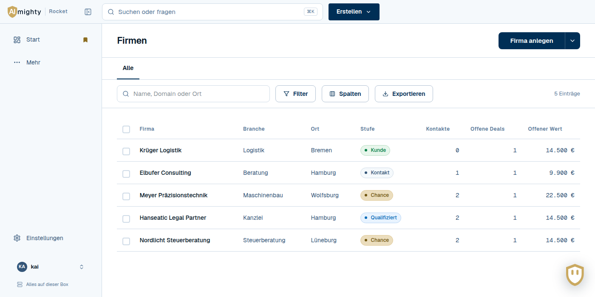

`components/segmentliste.tsx` →
`Segmentliste({ entity, basisPfad, suchePlatzhalter, leerTitel, leerText, stapelfelder })`;
`components/filterbau.tsx` → `Filterbau({ auskunft, bedingungen, verknuepfung, … })`.

- **Von oben nach unten:**
  1. Reiter mit gespeicherten Ansichten;
  2. Werkzeugleiste (Suche, Filter, Spalten, Export, „Als Ansicht
     speichern");
  3. Filterbau;
  4. Filterchips;
  5. Stapelleiste;
  6. Tabelle mit Auswahl und Sortierung am Kopf.
- **Eine Liste ist eine Frage an den Bestand**, die Reiter sind
  gespeicherte Fragen. Ein Filter, der greift, ist sichtbar, ohne ihn zu
  öffnen.
- Felder und Operatoren kommen vom Server (`/api/ansichten/felder`), die
  Oberfläche ist deshalb für jedes Objekt dieselbe.

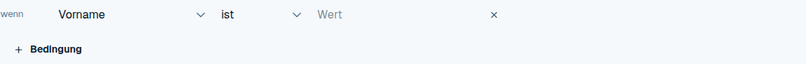

**Übernahme:** Der Filterbau ist fast frei (hängt an `Feldauskunft`,
`Bedingung`, HB-MEHRFACH). Für die ganze Liste müssten Zellen-Darstellung
und API-Pfade als Parameter herausgelöst werden.

### RK-FELDGRUPPEN — Eigenschaften in Gruppen ○ (◐ lib)

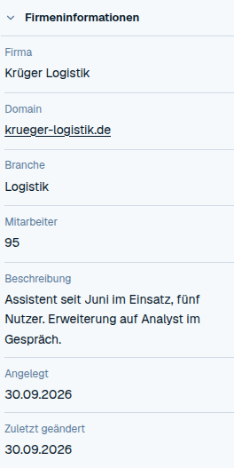

`components/feldgruppen.tsx` → `Feldgruppen({ entity, titel, pfad, werte, … })`,
`Eingabe({ feld, id, roh, setRoh, … })`; `components/anlegefelder.tsx` →
`useAnlegefelder(entity, vorhanden)`.

- **Nach HubSpot:** Gruppen als aufklappbare Abschnitte, gemerkt je
  Person.
- Zwei Wege zu ändern: der Stift am Feld oder „Alles bearbeiten".
- Ein leeres Pflichtfeld zeigt Zeichen und das Wort „fehlt".

`lib/feldwerte.ts` (anzeigen, in Eingabe verwandeln und zurück, Euro ↔
Cent, sichere URLs) und `lib/anordnung.ts` (Ziehen, Tastaturschritte,
Gruppen verschieben) sind reine Funktionen ohne React — mit Tests, gut
übertragbar.

### RK-EIGENSCHAFTEN — Eigenschaften verwalten ○

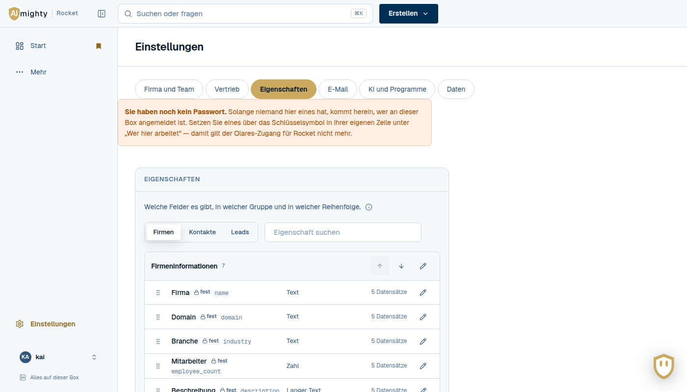

`components/eigenschaften-verwalten.tsx` → `Eigenschaftenblock()`.

- Je Objekt Gruppen und Felder, geordnet per Ziehen. Der Griff geht auch
  mit ↑/↓; die Ablage zeigt eine Linie, nicht nur eine Farbe.
- Feste Felder lassen sich verschieben und umbenennen, aber nicht löschen.
- Auswahlwerte werden archiviert statt gelöscht.

### RK-STAMMDATEN — Stammdaten ohne Gruppen ◐

`components/stammdaten.tsx` → `Stammdaten({ titel, pfad, felder, werte, … })`.
Ein Schalter macht alle Felder zu Eingaben. Noch von Angeboten und
Tickets benutzt; Firma, Kontakt und Lead nutzen RK-FELDGRUPPEN. Generisch
über `pfad`.

### RK-NOTIZ — Notiz → Struktur ○

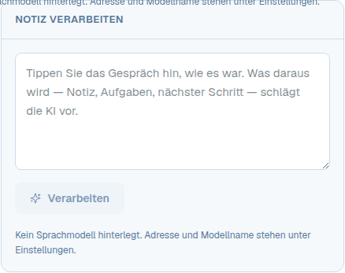

`components/notizkasten.tsx` → `Notizkasten({ bezug })`. Freitext
hinein, das Modell schlägt Art, Zusammenfassung, Aufgaben und
Qualifizierung vor. Jede Zeile ist abwählbar, gespeichert wird erst mit
„Übernehmen". Unbekannte Personen werden nicht angelegt — das wäre
geraten.

### RK-ANLEGEN — Anlegen-Dialoge ○

Kontakt, Firma, Lead, Ticket und Angebot folgen HB-DIALOG. Kontakt und
Firma bieten oben zwei Wege (`Wegwahl`):

- **Beschreiben** (`Finden`): Kandidaten aus Suchtreffern und Website, eine
  Quelle je Feld.
- **Hineinwerfen** (`Erfassung`): Text oder Bild einfügen.

Gefüllt wird, nicht gespeichert; nur leere Felder werden überschrieben.
Das Angebot ist noch in alter Bauart ohne festen Kopf und Fuß.

### RK-AUFGABEN — Aufgabenliste ○ (● CSS)

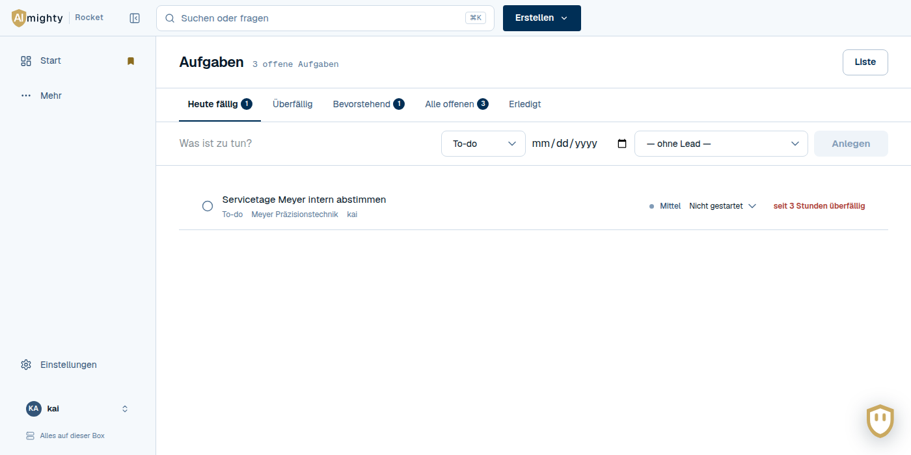

`app/aufgaben/page.tsx`.

- **Liste:** Reiter Heute / Überfällig / Bevorstehend / Alle / Erledigt,
  Schnellanlage in der Werkzeugleiste statt Dialog.
- **Zeile:** alles darin, ohne sie zu verlassen — Haken, Titel, Bezug,
  Dringlichkeit, Phase, Frist.
- **Umschalter** zur Tabellenform (RK-SEGMENTLISTE).
- Die Zeilenklassen `.aufgabe*` passen auch für eine Nachrichtenliste.

### RK-TICKET — Tickets ○

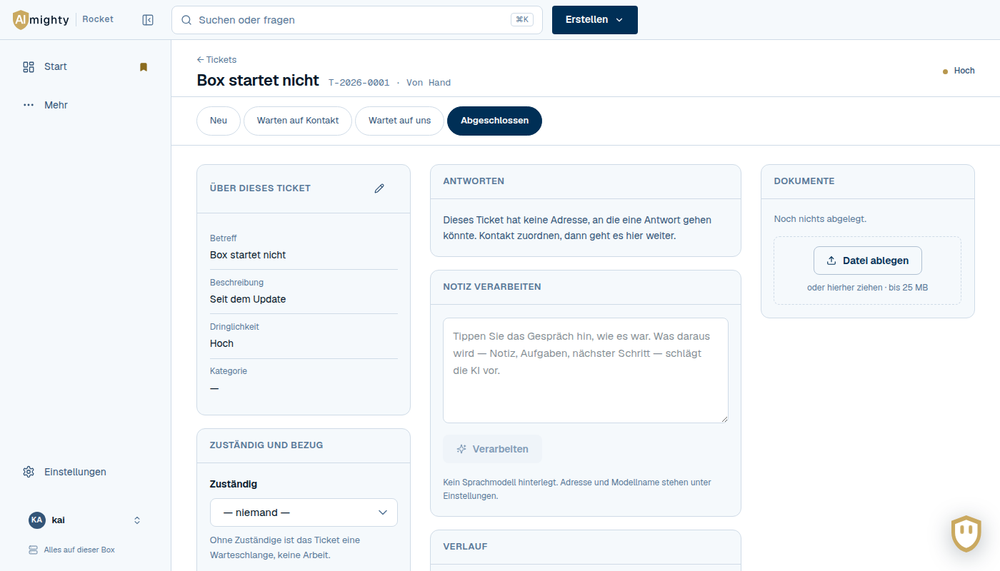

Brett (HB-BOARD) oder Tabelle, Umschalter `.sichtwahl`. Am Ticket die
Stufen als Schrittleiste `.stufenleiste`, Antwort per Mail
(`ticket-antwort.tsx`); die Kennung im Betreff hält den Faden. Die
Antwort ist inhaltlich Relays Kernaufgabe — dort besser neu gebaut als
von hier kopiert.

### RK-BRIEFING — Tagesbriefing ○

`components/briefing.tsx` → `Tagesbriefing()`. Sieben Gruppen, jede
erklärt ihre Regel („warum steht das hier"); auf Wunsch schlägt das
Modell eine Reihenfolge vor (in HB-KI).

### RK-PROGNOSE — Prognose ○

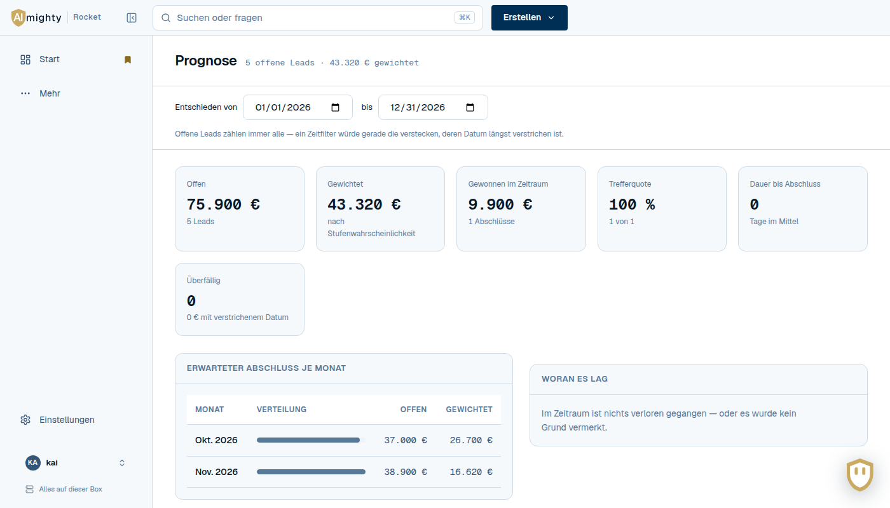

`app/prognose/page.tsx`: Zeitraum, sechs Kennzahlen (HB-KENNZAHL),
darunter `datensatz-zwei` mit Monaten, Verlustgründen und Produkten.

### RK-DOKUMENTE — Dateien am Datensatz ◐

`components/dokumente.tsx` → `Dokumente({ bezug })`. Liste mit Zeichen je
Dateityp, Ablagefläche, bis 25 MB. Geöffnet wird über einen gewöhnlichen
Link. Noch fast ganz mit Inline-Stilen gebaut; die Ablage aus RK-EINFUHR
wäre die Vorlage für eigene Klassen.

### RK-EINFUHR — CSV-Einfuhr ○ (● CSS)

`components/einfuhr.tsx` → `Einfuhrblock({ vorwahl? })`. Zwei Schritte:
Vorschau mit Zuordnung und Bilanz, dann Anlegen. Eine Einfuhr ohne
Vorschau wäre ein Sprung ins Dunkle. Die Ablagefläche `.einfuhr-ablage`
passt für jedes Hochladen.

### RK-DATENBANK — Datenbank-Blick ○

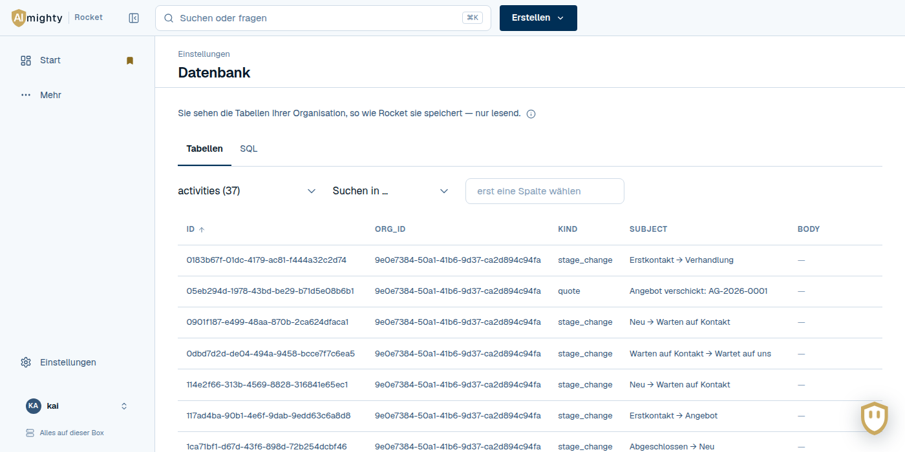

`app/datenbank/page.tsx`: Reiter Tabellen / SQL, Ergebnis als `.db-tabelle`
mit gekürzten Zellen, CSV. SQL geht im Körper eines POST, nie in die
Adresse.

### RK-PODCAST — Gespräch vorbereiten ○

`components/podcast.tsx` → `Podcastblock({ entity, entityId })`,
`HeuteVorbereitet()`, `Sprachausgabeblock({ e })`. Folge mit Player,
Skript und Herunterladen; der Fortschritt wird mit `aria-live` angesagt.

### RK-ANGEBOT — Angebot ○

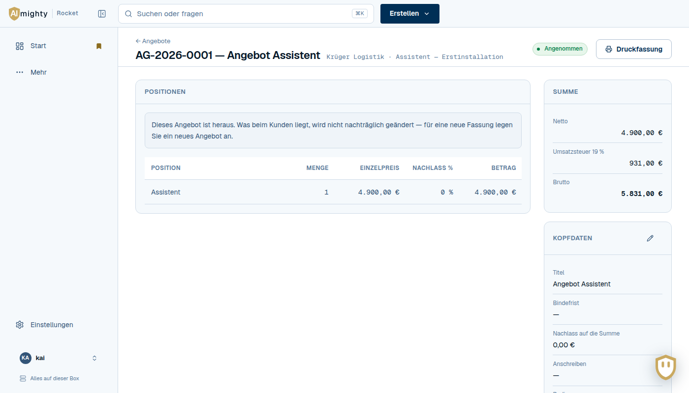

`app/angebote/[id]`: Positionen, Summen, Stand; `datensatz-seitenleiste`.
Die Druckfassung unter `/druck` nutzt HB-DRUCK.

### RK-LEAD — Teile der Lead-Seite ○

`components/beteiligte.tsx` (wer beteiligt ist, mit Kaufrolle),
`qualifizierung.tsx` (sechs Felder, gerechnete Punktzahl, Vorschlag aus
dem Verlauf), `kontakt-firmen.tsx` (Haupt- und weitere Firmen am Kontakt).
Alle als `.block` nach HB-BLOCK.

### RK-ANREICHERUNG — Firmen und Kontakte anreichern ○

`components/anreicherung.tsx`, `personen-finden.tsx`,
`anreicherung-einstellungen.tsx`, `abfrageanbieter.tsx`. Jeder Wert mit
Quelle; Kontaktdaten nur, wenn sie wörtlich in der Quelle stehen; leere
Felder von selbst, der Rest als Vorschlag.

### RK-VERSAND — Listen, Kampagnen, Einwilligung ○

`app/listen`, `app/kampagnen`, `components/kontakt-listen.tsx`,
`einwilligung.tsx`. Listen statisch oder als Filter (RK-SEGMENTLISTE,
Filterbau), Kampagnen nur an Kontakte mit belegter Einwilligung. Für Relay
fachlich nah — dort liegt der Versand ohnehin.

### RK-WISSEN — Fragen, Erkenntnisse, Eingang, Besprechungen ○

`app/fragen` (Antwort mit nummerierten Fundstellen `.fundstellen`, im
KI-Block), `app/erkenntnisse` (was Kunden sagen, in Themen),
`app/eingang` und `app/besprechungen` mit `besprechung-zuordnen.tsx`
(Insilo-Protokolle, Vorschlag statt Zuordnung von selbst) und
`insilo-ablage.tsx` (Stand der gemeinsamen Ablage).

### RK-EINSTELLUNGEN — die Blöcke der Einstellungen ○

Jeder folgt HB-EINSTELLUNGEN. Mitglieder und Passwort (`mitglieder.tsx`),
Geräte (`geraete.tsx`), Zweiter Faktor (HB-FAKTOR), Sicherung
(`sicherung.tsx`), Versand und Postfach (`versand.tsx`, `postfach.tsx`,
`absenderkonto.tsx`, `postausgang.tsx`), Briefkopf (`absender.tsx`),
Programme (`quellen.tsx`), Katalog und Verlustgründe (`katalog.tsx`),
Pipelines (`pipelines-verwalten.tsx`), Eigenschaften (RK-EIGENSCHAFTEN).
Versand, Postfach und Programme sind inhaltlich Relay-nah.

---

## Einen Baustein nach Relay holen

1. **Kennung suchen:** in der Übersicht oben, dann im Code
   (`grep -rn "HB-DIALOG" frontend`). Sie führt zur Datei und zum
   CSS-Abschnitt.
2. **Token prüfen:** Relay muss denselben AM-TOKEN-Block haben. Fehlt
   ein Token, kommt es aus dem Paket, nie als Wert ins Bauteil.
3. **Kopieren:** Datei und CSS-Abschnitt übernehmen, **die Kennung
   bleibt** — so sieht man später, dass beide Apps denselben Baustein
   tragen.
4. **Kopplung lösen:** Was unter „Übernahme" steht (Cookie-Name,
   Endpunkt, Produktwort), in Relay passend setzen. Wird dafür eine Prop
   nötig, gehört sie auch in Rockets Fassung — sonst laufen die beiden
   auseinander.
5. **Hier eintragen:** in der Übersicht in einer Spalte „Relay" (die
   entsteht mit dem ersten übernommenen Baustein), damit man sieht, wo er
   überall lebt.

Eine gemeinsame Bibliothek (ein Paket, das beide Apps einbinden) wäre der
nächste Schritt. Er lohnt erst, wenn mehrere HB-Bausteine in zwei Apps
wirklich gleich laufen. Bis dahin ist die Kennung die Klammer.

## Neue Bausteine

Wer einen Baustein baut, gibt ihm eine Kennung und trägt sie an **allen
drei Stellen** ein: Kopfkommentar der Datei, Überschrift des
CSS-Abschnitts und dieses Dokument. Ohne Fachlichkeit ist er HB, mit ihr
RK. Ein Bild dazu entsteht mit dem Prüflauf im Browser (siehe BETRIEB.md,
„GUI-Prüfung") und liegt unter `docs/module/`.

## Befunde beim Erfassen (offen)

Beim Durchgehen fiel auf, was nicht zur eigenen Regel passt. Nichts davon
ist akut; es ist die Liste für eine ruhige Stunde.

**Erledigt am 30.9.2026 (Aufräumen):**

- **Farbwerte:** Der CRM-Abschnitt ist farbwertfrei. Die Werte kamen in
  vier neue Rollen-Token: `--am-text-auf-farbe`,
  `--am-trenner-auf-handlung`, `--am-schatten-2` und
  `--am-schatten-schild`. Wo eine Handlungsfläche Weiß trug, gilt jetzt
  `--am-handlung-text`.
- **Klassen ohne CSS** sind entfernt. Die Tabellen der Einfuhr sind
  Rollflächen nach HB-TABELLE, und „holt ab" im Postfach ist eine
  HB-PILLE.
- **Ungenutzt und entfernt:**
  - CSS: `.pill`, `.quelle-freigabe`, `.filter-mehrfach`,
    `.deal-karte[data-zieht]`;
  - Code: `zusammenfassung()`, `PropertyDefinition`, `ANMELDEPFAD`,
    `anmeldung.frist` sowie fünf ungenutzte Importe und Variablen.
- **Wache:** `tsconfig.json` verlangt jetzt `noUnusedLocals` und
  `noUnusedParameters`.

**Erledigt in 26.9.6:**

- **Tastatur:** Listenzeilen öffnen mit Enter (HB-TABELLE), Karten
  wandern mit Alt+Pfeil (HB-BOARD), Reiter und Menüs kennen die Pfeile
  (HB-TASTATUR), der Assistent schließt mit Escape.
- **Dialog-Bauteil:** `Dialog` und `Rueckfrage` statt wiederholtem
  Markup (HB-DIALOG); dabei drei Dialoge ohne Tastaturführung gefunden
  und mitgenommen.
- **Inline-Stile:** Dokumente, Notizkasten, Dialogbreiten, Spalten von
  Start, Fragen und Einstellungen in Klassen; über sechzig wiederkehrende
  Stile als Textrollen (HB-TEXT). Übrig sind rund 250 Einzelfälle, meist
  ein Abstand.
- **Nebenbei gefunden:** Die Aufgaben-Tabelle führte beim Klick auf eine
  Zeile ins Leere (404), und am Lead ohne Sprachmodell hing die Knopfreihe
  aus dem Seitenkopf über dem ersten Block.
- **Wache:** Der CI-Job „oberfläche" geht jede Seite im Browser durch
  (BETRIEB.md, „GUI-Prüfung").

**Noch offen:**

- **Paketklassen ohne Nutzer:** `.streifen*`, `.deckschicht`,
  `table.am-tabelle`, `.tabelle-rahmen`, `.btn-gesperrt`,
  `.flaeche-auswahl`, `.huelle.hat-ablage`, `html[data-dichte]`. Sie
  bleiben (Paketgut); die App nutzt eigene Gegenstücke. Beim nächsten
  Paketabgleich klären, welche Seite recht hat.
- **Doppelte Wege:** Stammdaten und Feldgruppen tun dasselbe in zwei
  Bauarten. Angebote und Tickets nutzen noch Stammdaten; sie bleiben
  bewusst ohne Gruppen (Entscheidung zu den Eigenschaften, 30.9.2026).
- **Kontrast:** Gedämpfter Text liegt auf der Grundfläche bei 4,36:1 —
  eine Entscheidung über AM-TOKEN (BETRIEB.md, „GUI-Prüfung").
